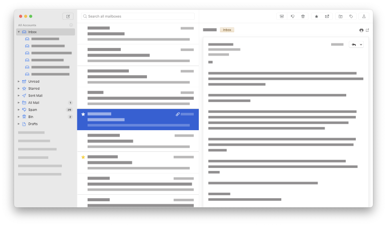

# Monterey Mailspring theme

A macOS Monterey-inspired theme for the [Mailspring](http://www.getmailspring.com/) email client.

## Installing this theme

Download the theme as a Zip file:

<https://github.com/zarino/monterey-mailspring-theme/archive/refs/heads/master.zip>

Unpack the Zip file, and place the `monterey-mailspring-theme` folder into the Mailspring Packages folder for your system:

| OS           | Location                                           |
|--------------|----------------------------------------------------|
| macOS        | ~/Library/Application Support/Mailspring/packages/ |
| Ubuntu native| ~/.config/Mailspring/packages/                     |
| Ubuntu Snap  | ~/snap/mailspring/common/packages/                 |
| Windows      | %appdata%\Mailspring\packages\                     |

(Note this theme is not actively supported on operating systems _other_ than macOS.)

Start Mailspring, and choose “Monterey” from the `Mailspring > Install Theme…` window.

## Developing this theme

Git clone the repo.

    git clone https://github.com/zarino/monterey-mailspring-theme.git

Install the theme:

    script/install

If you’re working on a debug version of Mailspring (with `Developer > Run with Debug Flags`) then you’ll want to run the install script with the `--dev` flag instead:

    script/install --dev

Start Mailspring, and choose “Monterey” from the `Mailspring > Install Theme…` window.

If you ever want to uninstall the theme, you can run `script/uninstall` or `script/uninstall --dev`.

## Accessing the underlying theme variables

Mailspring themes are applied on top of the base, built-in styles. You can browse the base `ui-variables.less` here:

<https://github.com/Foundry376/Mailspring/tree/master/app/static/style/base>

But beyond that, the base styles are spread between the app’s “components” directory:

<https://github.com/Foundry376/Mailspring/tree/master/app/static/style/components>

And the various “internal packages” that make up the various features within the app, for example:

<https://github.com/Foundry376/Mailspring/blob/master/app/internal_packages/account-sidebar/styles/account-sidebar.less>
<https://github.com/Foundry376/Mailspring/blob/master/app/internal_packages/composer/styles/composer.less>
<https://github.com/Foundry376/Mailspring/blob/master/app/internal_packages/notifications/styles/styles.less>
<https://github.com/Foundry376/Mailspring/blob/master/app/internal_packages/thread-list/styles/thread-list.less>
